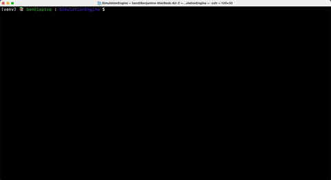

<div align="center">

# Simulation Engine
   
*Oct 2024 - Present* &nbsp;&nbsp;|&nbsp; Ben Winstanley 🙋‍♂️ 
</div>


<table>
  <tr>
    <td></td>
  </tr>
</table>
<table>
  <tr>
    <td></td>
    <td></td>
  </tr>
  <tr>
    <td></td>
    <td></td>
  </tr>
</table>

### General physics engine for force-based particle simulations, built from scratch in Python.

I'm interested in numerical simulation and modelling. I noticed that a lot of my previous simulation projects tended to share the same workflow: **initialisation**, **force-based timestepping**, **logging** and **rendering**. 

So to save myself 30 whole minutes of *gruelling, predictable* setup, I've spent the last year (on and off) working on this engine!

## 📍 Introduction

My simulation engine, or *bengine*, is a Python package featuring a commmand-line interface (CLI), where the user can choose from a number of preset simulation types to run - these pop up as little windows showing the final simulation on-loop:




Please have a quick scroll through the rest of this `README` if you'd like to learn more:
- See [Get Started](#get-started) and [Usage](#-usage) to install and try out the package! (this would make me very happy 🥺)
- See [Examples](#-examples) for an overview of the different force-based models currently implemented. 🎓
- See [Design Features](#-design-features), [Project Structure](#-project-structure), [Dependencies](#-dependencies), and [Next Steps](#-next-steps) for all the juicy details about the project. ☝️🤓

---

## 📚 Table of Contents

- [Get Started](#️-get-started)
- [Usage](#-usage)
- [Examples](#-examples)
- [Design Features](#-design-features)
- [Project Structure](#-project-structure)
- [Troubleshooting](#-troubleshooting)
- [Dependencies](#-dependencies)
- [Next Steps](#-next-steps)
- [License](#️-license)


##  🛠️ Get Started
1. Clone the repository
```shell
git clone https://github.com/benw000/Simulation-Engine.git
```
2. Create and activate a virtual environment
```shell
python -m venv venv

# (Linux/macOS)
source venv/bin/activate

# (Windows)
venv\Scripts\activate
```

3. Install as a package
```shell
python -m pip install --upgrade pip setuptools wheel
pip install -e .
```
Done!

Please see [Troubleshooting](#-troubleshooting) if you have any issues.

[(Back to contents)](#-table-of-contents)

---
## 🧑‍💻 Usage:

Below is a quick example showing most main command arguments.
#### Run a simulation

- Run a [Predator-Prey](#predator-prey-model-) simulation, with 10 Prey and 3 Predators
- Set the timestep duration to 0.01 seconds, and use 200 timesteps in total.
- Record a log of each particle's position, velocity etc. at each timestep in a readable `.ndjson` log, with a custom file path.
- Save an `.mp4` video of the simulation inside a custom folder path.

#### Load a simulation from logs

This reads the simulation you just logged and renders it again.

#### All arguments
Find help for all arguments with `bengine -h`:


See the examples below for different simulation types available:

[(Back to contents)](#-table-of-contents)

---
## 🌟 Examples:

### N-body Gravitational Dynamics 💫 


#### Run this 
```shell
bengine run nbody -n 30
```
#### Description

- Bodies are initialised with random positions and velocities, and masses of different magnitudes, chosen from a log-uniform distribution scale. 
- Each body feels a gravitational attraction towards every other body in the system. Larger bodies attract smaller ones, which accelerate towards them. 
- To a first order level of approximation, these smaller bodies then engage in elliptic orbits around the larger body, or are deflected, shooting off on a parabolic trajectory. As more bodies shoot off, their density in our viewing window decreases.

#### Forces
- Gravitational attraction force - each body is attracted to every other body in the system, following Newton's law of universal gravitation: \
$F = G \frac{Mass_1 Mass_2}{Distance^2}$.

---

### Classroom Evacuation Model 🎓


#### Run this 
```shell
bengine run evac -n 40 -t 200
```

#### Description

- People are initialised at random points in the classroom, and make their way to the nearest exit, periodically re-evaluating which exit to use. 
- The graph on the right shows the number of people evacuated over time, which can be used to score different classroom layouts for fire safety.
- Layouts are easily created by specifying pairs of vertices for each wall (seen in red), and specifying a number of target locations (green crosses).

**Forces**
- Constant attraction force to an individual's chosen target exit.
- Repulsion force between people - active within a personal space threshold, scales with $ \frac{1}{Distance}$
- Repulsion force from walls - also active within a threshold, scales with $ \frac{1}{Distance^2}$
- Deflection force from walls - force acting along length of wall towards an individual's target, prevents gridlock when a wall obscures the target.
- Stochastic force - a small amount of noise is applied.
- Note that additional bespoke forces would have to be specified in order to encode more intelligent, calculating behaviour.

---

### Spring System Model 🔗


#### Run this 
```shell
bengine run springs -n 50  -t 30
```

#### Description

- Point particles are initialised at random positions on the plane; if a neighbour is within a spring length away, a spring is formed. Particles with no connections are culled before step 0. 
- We see larger molecules start to form as networks of connected particles reach an equillibrium. 
- Setting a larger spring length allows more particles to connect to eachother, increasing the complexity of the structures formed.

**Forces** 
- Elastic force following Hooke's law: $F = -k \cdot (Spring \  Extension)$ \
This acts on both particles whenever the spring between them is in compression (red), or extension (yellow).
- Damping force - directly opposes particle motion, scaling linearly with velocity.
- Stochastic force - a small amount of random noise is applied to each particle.

---

### Predator-Prey Model 🦅


#### Run this 
```shell
bengine run -n 50 5 -t 200
```

#### Description

- Prey (white) and Predator (red) birds are initialised at random points. 
- The Predators act to hunt each Prey, always pursuing the closest bird and killing it within a certain distance threshold. 
- The Prey avoid the Predators, and flock together to increase chances of survival. 
- This all takes place on a torus topological domain, where opposite edges are connected with periodic boundary conditions. 
- The Predators aren't particularly intelligent, since their motion is governed by simple blind attraction at each timestep.

**Forces**
- Prey repulsion from all Predators within a radius of detection, scaling with $ \frac{1}{Distance}$ 
- Predator attraction to closest Pre with constant magnitude.
- Constant attraction force on Prey towards the centre of mass of all Prey birds - this naïvely encodes flocking behaviour.
- Repulsion force between birds - active within a personal space threshold, scales with $ \frac{1}{Distance}$.
- Stochastic force - a fair amount of noise is applied to the prey, to simulate erratic movements to throw off predators. Less noise is applied to the predators, which are very direct.

--- 

### 8-ball pool breaking simulation 🎱


#### Run this 
```shell
bengine run pool -n 1 -t 500
```

#### Description

- Pool balls are initialised in the normal setup, the cue ball starting off firing into the triangle with a slight random vertical deviance. 
- Balls repel off eachother, simulating elastic collision, and reflect off of the cushion walls, being removed if they hit the target of any pocket.

**Forces**
- Repulsion force between contacting balls - very strong but active within a small range, scaling with $ \frac{1}{Distance}$.
- Normal force from wall - this models each cushion as a spring, with any compression from incoming balls resulting in an outwards normal force on the ball, following Hooke's law.

[(Back to contents)](#-table-of-contents)

## 🔧 Troubleshooting

#### Pre-requisites
- Python 3.9 - similar versions should work fine, but I've only fully tested on 3.9.4. Please see the [pyenv guide](https://github.com/pyenv/pyenv) on how to manage multiple python versions on your system if you are using a different version.
- FFmpeg - see [installation guide](#ffmpeg) below.

#### Installing the package
Please make sure your tools are up to date:
```bash
# (Inside virtual environment)
python -m pip install --upgrade pip setuptools wheel
```

#### Matplotlib rendering
(Linux / WSL) If you see:
```
UserWarning: Matplotlib is currently using agg, which is a non-GUI backend, so cannot show the figure.
```
Try using the `TkAgg` GUI rendering backend for `matplotlib` by setting the following environment variable in your shell:
```bash
export MPLBACKEND=TkAgg
```
If this doesn't work, you may need to download `tkinter` for python in order to use the `TkAgg` backend.
```bash
sudo apt-get install python3-tk
```
After this you may need to reinstall python, now with `tkinter`.

#### Still stuck?
Please [open an issue](https://github.com/benw000/Simulation-Engine/issues) on GitHub — include your OS, Python version, and any error messages. Thank you!

[(Back to contents)](#-table-of-contents)

---
## 🔗 Dependencies

### Python
Python 3.9.7

### External Python libraries
The following external python libraries are found in the `pyproject.toml` file and will be installed automatically with `pip install bengine`.

| Package | Version | Usage |
| :---- | :----    | :---- |
| [numpy](https://numpy.org/) | `1.24.1` | Main computation |
| [matplotlib](https://matplotlib.org/) | `3.9.4` | Rendering |
| [opencv-python](https://opencv.org/) | `4.11.0.86` | Handling windows
| [rich](https://github.com/Textualize/rich) | `14.0.0` | Pretty printing and tables
| [tqdm](https://github.com/tqdm/tqdm) | `4.67.1` | Progress bars |
| [pathvalidate](https://pathvalidate.readthedocs.io/en/latest/) | `3.2.3` | Checking user-supplied paths 

---
### FFmpeg

We use the [FFmpeg](https://ffmpeg.org/) binary to save the rendered simulations as `.mp4` videos. \
This can be installed via your OS package manager: 

🪟 Windows: 
https://ffmpeg.org/download.html

🍎 macOS: 
```shell
brew install ffmpeg
```
🐧 Ubuntu/Debian: 
```shell
sudo apt install ffmpeg
```

[(Back to contents)](#-table-of-contents)


---
## 🌳 Project Structure
```
Simulation-Engine
+--- 📦 simulation_engine                 
│    +-- 📁 main
|    |   \-- entrypoint.py      # 👋 CLI entrypoint into program
│    +-- 📁 core
|    |   +-- manager.py         # 🧠 Contains main Manager class
|    |   +-- particle.py          # 🫧 Contains Particle class
|    |   \-- environment.py     # 🏡 Contains Environment, Wall, Target classes
│    +-- 📁 types
|    |   +-- birds.py           # 🦆 Predator-Prey
|    |   +-- evac.py            # 🎓 Classroom evacuation
|    |   +-- nbody.py           # 💫 N-body dynamics
|    |   +-- pool.py            # 🎱 Pool breaking
|    |   \-- springs.py         # 🔗 Spring system
|    \-- 📁 utils
|        \-- errors.py          # ❗️ Custom errors
|
+-- 📁 tests
│   +-- test_inputs_args.py     # ❌ Test handling bad inputs to CLI
│   \-- test_integration.py     # ✅ Test end-to-end integration of all modes
|
+-- 📁 data
|     +-- 📁 demo_videos        # ✨ Contains the shiny gifs you see in this README
|     +-- 📁 Simulation_Logs    # 🗄️ Folder for user-generated logs
|     \-- 📁 Simulation_Videos  # ▶️ Folder for user-generated videos
|
+-- pyproject.toml             # 📦 Project packaging for use with pip install
+-- README.md                  # 📖 What you're currently reading   
+-- LICENSE.md                 # ⚖️ License (MIT)
+-- .gitignore                 # 🔕 Tells git to ignore certain local files
```

[(Back to contents)](#-table-of-contents)

---

## 🥸 Design


### Architecture & Features


### Philosophy

### Trade-offs
---
## 🦆 Next steps
- [x] Create comprehensive CLI with argument validation.
- [x] Create unittest test suite for automated testing of all modes.
- [ ] Release as PyPI package.
- [ ] Introduce interactive mode for some simulation types (birds, pool) via PyGame backend.
- [ ] Create RL gym to train intelligent birds with PyTorch.
- [ ] Computational speedups with Numba JIT, further vectorisation.
- [ ] Implement as simple web-app.
- [ ] Open up to open-source support by making clear contribution guidance.

[(Back to contents)](#-table-of-contents)

---

## ⚖️ License

MIT License. See [LICENSE](LICENSE.txt) for more information.

[(Back to contents)](#-table-of-contents)
